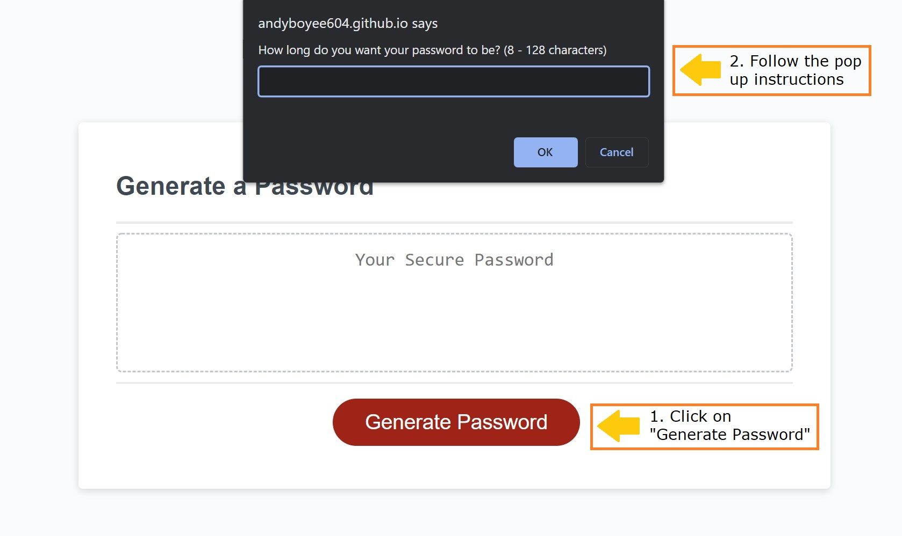

# Password Generator
Password Generator will generate a randomized password for you with highest security. You can chose anywhere from 8 to 128 characters, also to include or not include numbers, letters, capitalized letters, and special characters.

## Built With 
*HTML  
*CSS  
*JavaScript

## Website
https://andyboyee604.github.io/Password-Generator/

## Usage

Step 1: Click on "Generate Password"  
Step 2: Follow the instructions in the pop up window  
Note: Atleast one citeria has to be chosen so a randomized password can generate.

### Happy Generating!